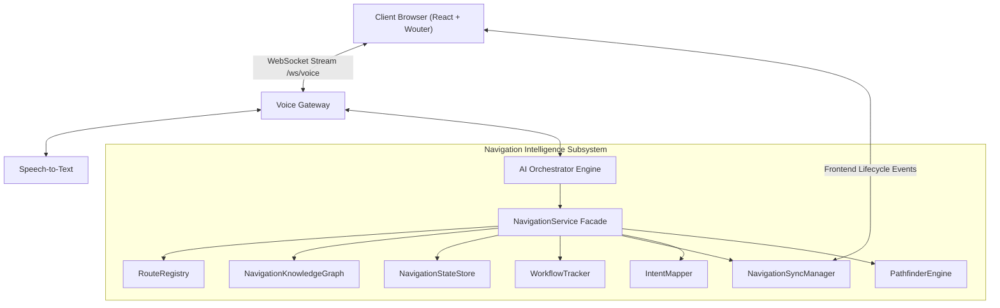
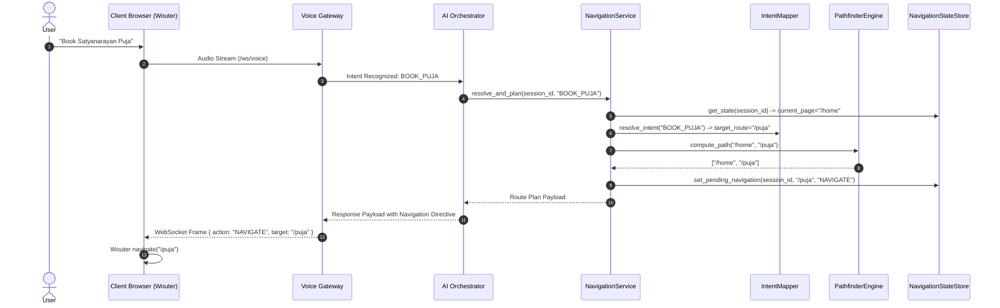

# Navigation Intelligence Architecture Specification (Sprint 1 Final Enhancement v1.1)

**Subsystem**: Navigation Intelligence Framework  
**Platform**: MantraSetu AI Voice Assistant Backend  
**Status**: Architecture & Implementation Spec (Production-Grade)

---

## 1. Subsystem Architectural Overview

The Navigation Intelligence Framework is an internal capability embedded within the MantraSetu AI Assistant runtime. It bridges client-side React + Wouter frontend route states with the server-side AI Orchestration pipeline.



---

## 2. Component Blueprint & Responsibilities

| Component Name | File | Primary Responsibility |
| :--- | :--- | :--- |
| **`RouteDiscoveryEngine`** | `app/navigation/discovery.py` | Automatically scans frontend Wouter routes and metadata. |
| **`RouteRegistry`** | `app/navigation/registry.py` | Thread-safe, dynamically extensible registry storing all frontend routes. |
| **`NavigationKnowledgeGraph`** | `app/navigation/knowledge_graph.py` | Bi-directional navigation graph supporting BFS shortest path traversal. |
| **`NavigationStateStore`** | `app/navigation/state_store.py` | Session-scoped navigation runtime state manager. |
| **`WorkflowTracker`** | `app/navigation/workflow_tracker.py` | Workflow memory tracker maintaining progress across voice prompts and reconnects. |
| **`NavigationSyncManager`** | `app/navigation/sync_manager.py` | Handles real-time frontend lifecycle sync events (`PAGE_CHANGED`, `LOGIN`, etc.). |
| **`IntentMapper`** | `app/navigation/intent_mapper.py` | Resolves AI conversation intents to target route paths and confidence scores. |
| **`PathfinderEngine`** | `app/navigation/pathfinder.py` | Computes optimal multi-step navigation paths between routes. |
| **`NavigationService`** | `app/navigation/service.py` | Unified application facade coordinating all Navigation Intelligence subservices. |

---

## 3. Sequence Flow: Voice Intent to Route Execution



---

## 4. State Store & Context Schema

```json
{
  "session_id": "sess_889210",
  "conversation_id": "conv_440192",
  "current_page": "/puja",
  "previous_page": "/",
  "navigation_history": ["/", "/services", "/puja"],
  "current_route_parameters": { "category": "shanti" },
  "active_workflow": "PUJA_BOOKING",
  "workflow_step": "SELECT_PUJA",
  "pending_navigation": "/puja/102",
  "pending_action": "NAVIGATE",
  "last_user_intent": "BOOK_PUJA",
  "auth_state": "AUTHENTICATED",
  "updated_at": "2026-07-31T22:26:00Z"
}
```

---

## 5. Future Scalability & Extensibility

- **Zero-Code Route Expansion**: Adding a new page (e.g. `/donations` or `/live-darshan`) requires calling `RouteRegistry.register_route()`. The knowledge graph, pathfinder, and state store automatically update without architectural modifications.
- **Workflow State Preservation**: `WorkflowTracker` guarantees multi-prompt transactions survive page refreshes, voice interruptions, and network reconnects.
- **Full Backward Compatibility**: All frozen backend modules (Modules 1–5) interact with `NavigationService` via read-only context enrichment and facade calls.
